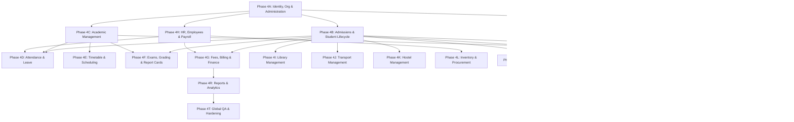

# Enterprise School Management System — Phase 4 Comprehensive Feature Roadmap

## 1. Primary Objective & Architectural Foundation

Phase 4 transforms the foundational architecture (Phase 1), core workflows (Phase 2), and accessible design system (Phase 3) into an integrated, production-grade School Operating System.

### Absolute Architectural Constraints (LOCKED)
- **Web Frontend:** Next.js 16 (App Router), React, TypeScript, Phase 3 Design Tokens
- **Backend API:** NestJS 11, Fastify engine, TypeScript, Swagger/OpenAPI
- **Database:** PostgreSQL 18, Prisma ORM
- **Infrastructure:** Redis, BullMQ async workers, MinIO / S3, Docker, Nginx reverse proxy
- **Cross-Platform:** Flutter & Dart (Mobile & Desktop Workstation)
- **Monorepo:** pnpm workspace, Turborepo pipeline

---

## 2. Global Phase 4 Dependency Graph

---

## 3. Phased Execution Sequence (4A through 4T)

### **PHASE 4A — Identity, Organization & Administration Expansion (CURRENT)**
- **Scope:** Organization profile expansion, multi-campus management, department CRUD, designation CRUD, academic years & terms, system configuration grouping, user lifecycle state machine (`ACTIVATE`, `DEACTIVATE`, `SUSPEND`, `RESTORE`, `ARCHIVE`), role management, fine-grained permissions, login/session management (`UserSession`), security settings, and audit trails.

### **PHASE 4B — Admissions & Student Lifecycle**
- **Scope:** Complete lifecycle: Applicant → Admission Review → Enrolled → Active → Promoted/Transferred → Graduated/Withdrawn → Alumni. Multi-guardian linking, emergency contacts, student documents, and campus transfers.

### **PHASE 4C — Academic Management**
- **Scope:** Classes, sections, subjects, subject groups, curriculum structures, teacher assignments, class teacher assignments, promotion rules, and academic calendars.

### **PHASE 4D — Attendance & Leave**
- **Scope:** Student, teacher, and staff attendance. Late arrivals, half-day, excused absences, correction workflows. Employee leave balances, applications, and approvals. Architecture ready for Biometric/RFID.

### **PHASE 4E — Timetable & Scheduling**
- **Scope:** Period definitions, time slots, class timetable, teacher timetable, room allocation, deterministic conflict detection engine.

### **PHASE 4F — Examinations, Grading & Report Cards**
- **Scope:** Exam schedules, weightings, marks entry, marks correction workflow, result calculation, grade scales, rank calculation, result publishing/locking, printable report cards and transcripts.

### **PHASE 4G — Fees, Billing & Finance**
- **Scope:** Fee categories, structures, student-specific fees, concessions, late fee rules, invoice generation, partial payments, receipts, outstanding ledger, defaulter tracking, and daily collection reports.

### **PHASE 4H — HR, Employees & Payroll**
- **Scope:** Employee lifecycle, contracts, departments, designations, salary structures (basic, allowances, deductions), payroll periods, payslip generation, and payroll approval workflows.

### **PHASE 4I — Library Management**
- **Scope:** Book catalog, ISBN, copies, shelf locations, student and staff memberships, issue/return/renewal, overdue fines, and lost book tracking.

### **PHASE 4J — Transport Management**
- **Scope:** Vehicles, drivers, routes, stops, student allocations, vehicle capacity, transport fees, and route schedules.

### **PHASE 4K — Hostel Management**
- **Scope:** Hostels, buildings, rooms, bed allocations, check-in/check-out, attendance, warden assignment, and vacancy tracking.

### **PHASE 4L — Inventory & Procurement**
- **Scope:** Items, categories, stock ledger (stock in, stock out, transfers, adjustments), reorder levels, suppliers, purchase requests, and purchase orders.

### **PHASE 4M — Communication & Notification Ecosystem**
- **Scope:** Multi-channel notification engine (internal announcements, broadcasts, email, SMS, WhatsApp readiness), template engine, BullMQ async queueing, delivery logs, and retry handling.

### **PHASE 4N — Parent Portal**
- **Scope:** Multi-child switcher, verified parent-child relationship security, attendance, fee payments, term results, announcements, and teacher messaging.

### **PHASE 4O — Student Portal**
- **Scope:** Personal academic profile, class timetable, attendance rate, exam schedule, published report cards, fee status, and school notices.

### **PHASE 4P — Teacher Portal**
- **Scope:** Assigned classes and subjects, daily roll call, timetable, marks entry sheets, student roster, announcements, and leave requests.

### **PHASE 4Q — Documents, Certificates & Printing**
- **Scope:** Centralized document management, verifiable printable certificates (Bonafide, Character, Enrollment, Transfer Certificate) with reference numbers and security metadata.

### **PHASE 4R — Reports & Analytics**
- **Scope:** Cross-domain reporting engine (Census, Attendance, Fees, Exams, HR, Inventory), date ranges, campus filters, CSV and print-ready PDF export.

### **PHASE 4S — Integrations & External Services**
- **Scope:** Pluggable adapters for Email (SMTP/SES), SMS gateways, Payment gateways, S3 storage, and Barcode/QR generation.

### **PHASE 4T — Global QA, Security, Performance & Production Hardening**
- **Scope:** End-to-end multi-role verification across 16 user roles, load testing, security audit, database index optimization, and final production checklist.

---

## 4. Phase 4A Permission Matrix

| Module | Action | Permission Code | Super Admin | Principal | Academic Coordinator | HR Officer | Accountant |
| :--- | :--- | :--- | :---: | :---: | :---: | :---: | :---: |
| **Organization** | Read | `settings:read` | ✅ | ✅ | ✅ | ❌ | ❌ |
| **Organization** | Manage | `settings:manage` | ✅ | ❌ | ❌ | ❌ | ❌ |
| **Campuses** | Read | `campuses:read` | ✅ | ✅ | ✅ | ✅ | ✅ |
| **Campuses** | Manage | `campuses:manage` | ✅ | ❌ | ❌ | ❌ | ❌ |
| **Departments** | Read | `departments:read` | ✅ | ✅ | ✅ | ✅ | ❌ |
| **Departments** | Manage | `departments:manage` | ✅ | ✅ | ❌ | ✅ | ❌ |
| **Designations** | Read | `designations:read` | ✅ | ✅ | ✅ | ✅ | ❌ |
| **Designations** | Manage | `designations:manage` | ✅ | ❌ | ❌ | ✅ | ❌ |
| **Academic Years** | Read | `academics:read` | ✅ | ✅ | ✅ | ❌ | ❌ |
| **Academic Years** | Manage | `academics:manage` | ✅ | ✅ | ❌ | ❌ | ❌ |
| **Terms / Semesters** | Read | `academics:read` | ✅ | ✅ | ✅ | ❌ | ❌ |
| **Terms / Semesters** | Manage | `academics:manage` | ✅ | ✅ | ❌ | ❌ | ❌ |
| **Users** | Read | `users:read` | ✅ | ✅ | ✅ | ✅ | ❌ |
| **Users** | Create | `users:create` | ✅ | ✅ | ❌ | ✅ | ❌ |
| **Users** | Update | `users:update` | ✅ | ✅ | ❌ | ✅ | ❌ |
| **Users** | Lifecycle (Suspend/Archive) | `users:manage` | ✅ | ❌ | ❌ | ❌ | ❌ |
| **Roles & Perms** | Read | `roles:read` | ✅ | ✅ | ❌ | ❌ | ❌ |
| **Roles & Perms** | Manage | `roles:manage` | ✅ | ❌ | ❌ | ❌ | ❌ |
| **Sessions** | Read / Revoke | `sessions:manage` | ✅ | ❌ | ❌ | ❌ | ❌ |
| **Audit Logs** | Read | `audit:read` | ✅ | ✅ | ❌ | ❌ | ❌ |
