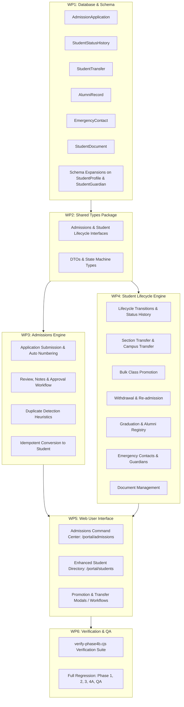

# Phase 4B — Admissions & Student Lifecycle Specification

## 1. Domain Status & Gap Analysis

### EXISTING (Reused Without Unnecessary Modification)
1. **`StudentProfile` & `User` Account Core**:
   - Basic identity (`firstName`, `lastName`, `email`, `phone`, `gender`).
   - One-to-one mapping between `User` and `StudentProfile`.
   - Argon2 hashed credentials with `STUDENT` system role assignment.
2. **`GuardianProfile` & `StudentGuardian` Core**:
   - One-to-one mapping between `User` and `GuardianProfile` with `PARENT` system role.
   - Many-to-many relationship join table `StudentGuardian` (`studentId`, `guardianId`, `isPrimary`).
3. **`Enrollment` Foundation**:
   - Link between `StudentProfile`, `AcademicYear`, `Section`, with optional `rollNumber`.
   - Unique constraint `@@unique([academicYearId, studentId])` preventing duplicate enrollments in the same year.
4. **Academics Section Roster & Class Structure**:
   - `Class`, `Section`, `AcademicYear`, `Term`.
5. **Storage Infrastructure**:
   - `StorageService` with MinIO/S3 signed URL generation and `FileMetadata` registration.
6. **Audit & Notification Infrastructure**:
   - `AuditService.log()` with multi-criteria querying.
   - `NotificationService.broadcast()` and user-targeted notifications.

---

### MISSING (To Be Built in Phase 4B)
1. **Admissions Application Workflow**:
   - `AdmissionApplication` model with collision-safe application number strategy (`APP-YYYY-XXXXX`).
   - Complete application lifecycle: `DRAFT` → `SUBMITTED` → `UNDER_REVIEW` → `APPROVED` / `REJECTED` / `WITHDRAWN` → `ADMITTED`.
   - Application review API with review notes, decision reason, reviewer tracking, and role-based permissions (`admissions:review`, `admissions:approve`, `admissions:reject`).
2. **Atomic Application-to-Student Conversion**:
   - Idempotent conversion of approved application to real `User`, `StudentProfile`, `StudentGuardian`, and `Enrollment`.
   - Collision-safe, configurable admission number generator (`ADM-YYYY-XXXXX`).
   - Duplicate conversion protection.
3. **Student Profile Expansion**:
   - Extended demographic, contact, and medical fields: `nationalId`, `address`, `previousSchool`, `medicalNotes`, `emergencyContactName`, `emergencyContactPhone`, `emergencyContactRelation`.
   - First-class `EmergencyContact` entity with priority ordering.
   - Guardian relationship enrichment (`relationship`, `isEmergencyContact`, `canPickup`).
4. **Student Lifecycle State Machine & History**:
   - Lifecycle statuses: `APPLICANT`, `ADMITTED`, `ACTIVE`, `TRANSFERRED`, `WITHDRAWN`, `GRADUATED`, `ALUMNI`, `SUSPENDED`.
   - Append-only `StudentStatusHistory` tracking actor, reason, timestamps, and state transitions.
5. **Class Promotion & Bulk Processing**:
   - Bulk and single-student promotion workflow between academic years and classes.
   - Preview, validation of conflicts, exception tracking, transaction-safe execution, and audit trail.
6. **Controlled Transfers (Section & Campus)**:
   - Section transfer with historical tracking (`StudentTransfer` with `TransferType.SECTION`).
   - Campus transfer preserving historical academic records (`StudentTransfer` with `TransferType.CAMPUS`).
7. **Withdrawal & Graduation Workflows**:
   - Formal withdrawal recording reason, date, exit notes, and status transition to `WITHDRAWN`.
   - Formal graduation recording graduation year, final grade, and creating `AlumniRecord`.
8. **Student Document Management**:
   - `StudentDocument` entity linked to `StudentProfile` and `AdmissionApplication`.
   - Secure upload, permission-guarded download URLs, document type catalog, and verification status.
9. **Duplicate Detection Engine**:
   - Fuzzy/deterministic heuristic matching across name, date of birth, guardian phone, and email to detect potential duplicate applicants before admission.
10. **Web UI Experiences**:
    - Dedicated Admissions Hub (`/portal/admissions`) with statistics, search, filters, application detail, review dialog, and one-click student conversion.
    - Upgraded Student Directory (`/portal/students`) with lifecycle status tabs, comprehensive detail drawer (Overview, Guardians, Academic, Documents, History), and actions (Transfer, Withdraw, Promote, Graduate).

---

### TO BE IMPLEMENTED (Phase 4B Work Packages)

---

### DEFERRED (Scheduled for Subsequent Phases)
1. **Public/External Admission Portal without Authentication**:
   - Self-service parent application submission via public web portal is scheduled for Phase 4N (Parent Portal) and Phase 4S (Integrations). Phase 4B provides the internal administrative and admissions officer workflow and API foundations.
2. **AI-Driven Automated OCR Document Parsing**:
   - Automated text extraction from birth certificates / marksheets deferred to Phase 4Q (Documents & Certificates).
3. **Automated Fee Generation on Admission**:
   - Automatic debiting and installment scheduling deferred to Phase 4G (Finance & Fees Expansion).
4. **Custom Promotion Examination Cutoff Automation**:
   - Automated promotion rule triggers based on weighted exam results deferred to Phase 4F (Examinations & Grading).
