# Phase 4C — Academic Management Specification

## 1. Domain Status & Gap Analysis

### EXISTING (Reused Without Unnecessary Modification)
1. **Academic Years & Terms**:
   - `AcademicYear` model with multi-campus scoping, date ranges, and `isCurrent` toggle.
   - `Term` model with date ranges, `isCurrent` active term flag, and academic year linkage.
   - `academics:read` and `academics:manage` permission guards.
2. **Classes & Sections**:
   - `Class` model with campus scoping, order index, and unique `[campusId, code]`.
   - `Section` model with class relation, room capacity, `classTeacherId`, and unique `[classId, name]`.
3. **Subjects & Basic Assignments**:
   - `Subject` model with unique code, elective flag, and credit hours.
   - `SubjectTeacher` join model mapping `subjectId`, `teacherId`, and `sectionId`.
4. **Student Enrollment Core**:
   - `Enrollment` model linking `StudentProfile`, `AcademicYear`, and `Section` with `rollNumber`.
   - Unique constraint `@@unique([academicYearId, studentId])` preventing duplicate enrollments in the same academic year.
   - Section transfer logic (`transferSection`) and section roster queries (`getSectionRoster`).
5. **Phase 4B Promotion Integration**:
   - Promotion workflows (`promotePreview` and `bulkPromote`) established in Phase 4B.

---

### MISSING (To Be Built in Phase 4C)
1. **Academic Calendar System**:
   - `AcademicCalendarEvent` model with categories (`HOLIDAY`, `EXAMINATION`, `EVENT`, `TERM_START`, `TERM_END`, `STAFF_DEVELOPMENT`).
   - Campus and academic year scoping, target audience segmentation (`ALL`, `STUDENTS`, `TEACHERS`, `PARENTS`), and date range validation.
   - Calendar API endpoints for monthly and list agenda queries.
2. **Curriculum Layer & Subject Offerings**:
   - `Curriculum` model defining formal course of study per class and academic year.
   - `CurriculumSubject` mapping subjects to curricula with required/elective flags, credit hours, and sequence order.
   - `SubjectOffering` model anchoring actual subject instruction to an academic year, term, class, section, and primary teacher.
3. **Class Teacher Historical Assignment**:
   - `ClassTeacherAssignment` append-friendly model tracking historical class teacher appointments with start/end dates.
4. **Subject Classification & Department Linkage**:
   - Expanding `Subject` with `category` (`CORE`, `ELECTIVE`, `LANGUAGE`, `SCIENCE`, `HUMANITIES`, `COMPUTING`, `CO_CURRICULAR`, `LAB`, `OTHER`) and optional `departmentId`.
5. **Next Class Promotion Sequence**:
   - Adding `nextClassId` to `Class` model to establish automated next-grade progression hierarchies.
6. **Section Capacity Protection & Audited Overrides**:
   - Enforcement of section capacity during enrollment with audited override permission (`sections:manage-capacity`).
7. **Elective Course Enrollment**:
   - `CourseEnrollment` model for elective subject offerings.
8. **Teaching Load & Assignment Matrix Engine**:
   - Teacher workload aggregation across sections, subjects, and periods.
9. **Dedicated Web UI Modules**:
   - Academic Command Center overview dashboard with live metrics.
   - Class & Section management hierarchy with capacity indicators.
   - Subject catalog & curriculum matrix visualizer.
   - Teacher assignment matrix.
   - Academic Calendar visualizer (Month and List views).

---

### TO BE IMPLEMENTED (Phase 4C Work Packages)

```mermaid
flowchart TD
    subgraph WP1["WP1: Database & Schema Expansions"]
        E1[AcademicCalendarEvent]
        E2[Curriculum & CurriculumSubject]
        E3[SubjectOffering]
        E4[ClassTeacherAssignment]
        E5[CourseEnrollment]
        E6[Class.nextClassId & Subject.category / departmentId]
    end

    subgraph WP2["WP2: Shared Types Package"]
        T1[Academic Interfaces & DTOs]
        T2[Calendar, Curriculum & Assignment Types]
    end

    subgraph WP3["WP3: Backend Services & API Endpoints"]
        A1[AcademicCalendarService & Controller]
        A2[CurriculumService & Controller]
        A3[SubjectOfferings & TeacherAssignment Engine]
        A4[Capacity Guarded Enrollment & Overrides]
        A5[Teaching Load Calculator]
    end

    subgraph WP4["WP4: Web UI Academic Command Center"]
        UI1[Academics Hub Overview /portal/academics]
        UI2[Curriculum Matrix & Offerings /portal/academics/curriculum]
        UI3[Teacher Assignment Matrix /portal/academics/teachers]
        UI4[Academic Calendar /portal/academics/calendar]
    end

    subgraph WP5["WP5: Verification & Zero-Regression QA"]
        V1[scripts/verify-phase4c.cjs Verification Suite]
        V2[Master Regression: Phase 1, 2, 3, 4A, 4B, 4C]
    end

    WP1 --> WP2
    WP2 --> WP3
    WP3 --> WP4
    WP4 --> WP5
```

---

### DEFERRED (Scheduled for Subsequent Phases)
1. **Automated Timetable Slot Generator & Conflict Detector**:
   - Mathematical room/teacher collision resolution engine deferred to Phase 4E (Timetable & Scheduling).
2. **Grading Weighting Schemes & Exam Hall Allocation**:
   - Deferred to Phase 4F (Examinations & Grading).
3. **Parent Portal Subject Selection Interface**:
   - Self-service parent/student elective course picking deferred to Phase 4N / Phase 4O.
