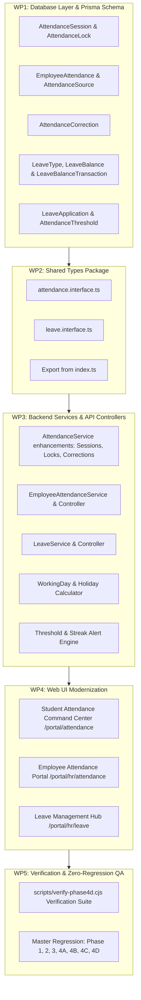

# Phase 4D — Attendance & Leave Management Specification

## 1. Domain Status & Gap Analysis

### EXISTING (Reused Without Unnecessary Modification)
1. **Student Attendance Core**:
   - `AttendanceRecord` model in Prisma: `studentId`, `sectionId`, `date`, `status`, `remarks`, `createdAt`, `updatedAt`, `createdBy`, `updatedBy`.
   - `AttendanceStatus` enum: `PRESENT`, `ABSENT`, `LATE`, `HALF_DAY`, `EXCUSED`.
   - `AttendanceService` in `apps/api/src/modules/attendance/attendance.service.ts`:
     - `verifySectionAccess(user, sectionId)`: Checks Super Admin, Principal, or assigned Class Teacher / Subject Teacher.
     - `getRosterForDate(user, sectionId, date)`: Pulls section enrollments and maps recorded attendance.
     - `markAttendance(user, sectionId, date, records)`: Bulk upserts student attendance records.
     - `getSummary(sectionId, startDate, endDate)`: Calculates total, present, absent, late, and attendance rate %.
   - `AttendanceController` in `apps/api/src/modules/attendance/attendance.controller.ts`:
     - `GET /attendance/roster`
     - `POST /attendance/mark`
     - `GET /attendance/summary`
     - Guarded by `attendance:read` and `attendance:mark`.
   - Web UI `apps/web/src/app/(dashboard)/portal/attendance/page.tsx`:
     - Section select, Date picker, Roster with status pills, Mark All Present, Save Attendance.
2. **Academic Calendar & Scheduling Integration**:
   - `AcademicYear`, `Term`, `Class`, `Section`, `Enrollment` from Phase 1, 2, and 4C.
   - `AcademicCalendarEvent` from Phase 4C: `category` (`HOLIDAY`, `TERM_START`, `TERM_END`, `EXAMINATION`), `isHoliday`, target audience. This allows identifying official institutional holidays.
3. **Identity & People Hierarchy**:
   - `StudentProfile`, `TeacherProfile`, `EmployeeProfile`, `User`, `Department`, `Designation`.
   - Teachers link to `User` and `Section` via `TeacherProfile` and `ClassTeacherAssignment`.
   - Non-teaching and teaching employees link to `Department` and `Designation` via `EmployeeProfile`.
4. **Audit & Notifications Foundation**:
   - `AuditModule` with `AuditService.log(...)` from Phase 1 & 4A.
   - `NotificationsModule` with `NotificationsService` from Phase 2.

---

### MISSING (To Be Built in Phase 4D)
1. **Attendance Sessions & Extensible Capture**:
   - `AttendanceSession` model: Tracking attendance sessions (`FULL_DAY`, `MORNING`, `AFTERNOON`, `PERIOD`) per section/date with session locking.
   - Adding `source` (`MANUAL`, `WEB`, `MOBILE`, `BIOMETRIC`, `RFID`, `API`) to attendance records.
2. **Employee & Teacher Attendance Subsystem**:
   - `EmployeeAttendance` model: Tracking employee daily attendance with `employeeId`, `date`, `status` (`PRESENT`, `ABSENT`, `LATE`, `HALF_DAY`, `ON_LEAVE`), optional `checkInTime`, `checkOutTime`, `source`, `remarks`, and `isLocked`.
   - Chronological validation for check-in/check-out events.
3. **Controlled Attendance Corrections Workflow**:
   - `AttendanceCorrection` model: Supporting correction requests (student or employee), storing original status, requested status, reason, requester, reviewer, status (`PENDING`, `APPROVED`, `REJECTED`), decision notes, and audit trail logging.
4. **Attendance Locking**:
   - `AttendanceLock` model: Configurable locking at Date, Section, Session, or Month level to prevent unauthorized historical edits once attendance is closed.
5. **Thresholds, Alerting & Absence Streaks**:
   - `AttendanceThreshold` model: Minimum, warning, and critical percentages per campus/organization.
   - Streak analytics: consecutive absences, repeated lateness, and automated low-attendance threshold warnings via notifications.
6. **Complete Leave Management Subsystem**:
   - `LeaveType` model: Configurable types (Annual, Casual, Sick, Maternity, Paternity, Unpaid, Emergency) with paid flag, default quota, and document requirement.
   - `LeaveBalance` model: Per employee/leaveType/year tracking opening balance, accrued, used, pending, and closing balance.
   - `LeaveBalanceTransaction` model: Transactional audit ledger (`ALLOCATION`, `USAGE`, `REVERSAL`, `ADJUSTMENT`) preventing untracked balance changes.
   - `LeaveApplication` model: Employee/teacher leave requests with start/end dates, working day duration calculation, reason, supporting documents, status workflow (`DRAFT`, `SUBMITTED`, `UNDER_REVIEW`, `APPROVED`, `REJECTED`, `CANCELLED`), reviewer notes, and balance reservation/deduction.
   - `LeaveCalendar` queries by employee, department, and campus.
7. **Holiday & Working Day Calculation Engine**:
   - Attendance and leave duration calculations respecting weekends and `AcademicCalendarEvent.isHoliday` from Phase 4C.
8. **Permissions & Server-Side Security**:
   - Granular permissions: `attendance:read`, `attendance:mark`, `attendance:correct`, `attendance:approve-correction`, `attendance:lock`, `attendance:report`, `employee-attendance:read`, `employee-attendance:mark`, `leave:read`, `leave:apply`, `leave:approve`, `leave:manage-policies`.
9. **Web UI Command Centers**:
   - Student Attendance Workspace (`/portal/attendance`): Add Session selector, Correction request modal, Attendance lock indicator, Attendance summary cards.
   - Employee Attendance Workspace (`/portal/hr/attendance`): Employee roster, check-in/check-out punch logging, status filters, and monthly summaries.
   - Leave Management Hub (`/portal/hr/leave`): Leave applications table, approval/rejection drawer, balance inspection, Leave policy configuration, and Leave calendar.

---

### DEFERRED (Out of Scope for Phase 4D)
- Physical biometric / RFID / barcode hardware driver SDKs and serial port listeners (data models will support `source: BIOMETRIC | RFID | BARCODE | API`, but hardware devices are not connected in Phase 4D).
- Machine learning predictive absenteeism forecasting.
- Automatic payroll salary deductions (formal payroll calculation deferred to Phase 4H).

---

## 2. Work Packages Breakdown

