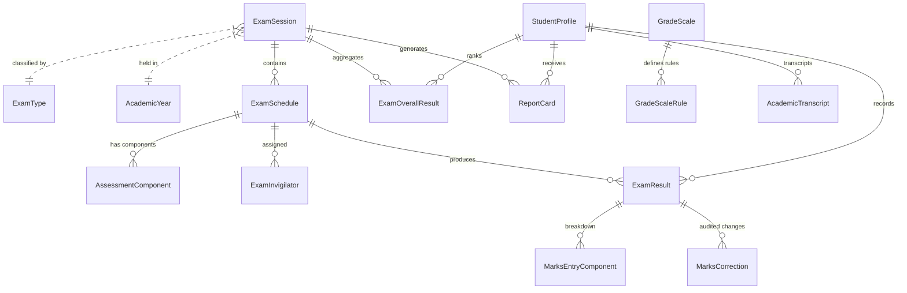

# Phase 4F Final Report — Examinations, Grading & Report Cards

**Date:** September 19, 2026  
**Status:** COMPLETE & VERIFIED  
**Zero Regressions:** 1,075 / 1,075 Assertions Passing across all phases (Phase 1, 2, 3, QA, 4A, 4B, 4C, 4D, 4E, 4F)

---

## 1. Executive Summary

Phase 4F transforms the foundational marks recording mechanism into a production-grade, configurable, enterprise academic assessment subsystem. The subsystem coordinates examination types, institutional exam sessions, multi-subject scheduling, room & faculty invigilation assignments, multi-part component weighting, numeric marks validation, teacher submission workflows, audited marks correction procedures, dynamic grading scale resolution, consolidated student session ranking, administrative approval/locking/publication gates, print-ready student report cards integrating Phase 4D attendance metrics, and multi-year cumulative academic transcripts.

All 133 automated verification checks authored specifically for Phase 4F passed without defect. In addition, all 942 previous regression assertions across Phase 1, Phase 2, Phase 3, Acceptance QA, Phase 4A, Phase 4B, Phase 4C, Phase 4D, and Phase 4E passed with zero regressions.

---

## 2. Architecture & Data Model Expansions

The database schema (`apps/api/prisma/schema.prisma`) has been extended with 14 models, 5 new enums, and explicit relations connecting across Organizations, Campuses, Academic Years, Terms, Classes, Sections, Subjects, Rooms, Teacher Profiles, and Student Profiles:

### Models & Enums Summary
1. **Enums Added:**
   - `ExamSessionStatus`: `DRAFT`, `SCHEDULED`, `IN_PROGRESS`, `COMPLETED`, `REVIEW`, `APPROVED`, `LOCKED`, `PUBLISHED`, `ARCHIVED`
   - `MarksEntryStatus`: `DRAFT`, `ENTERED`, `SUBMITTED`, `REVIEWED`, `APPROVED`, `LOCKED`
   - `ResultStatus`: `PASS`, `FAIL`, `INCOMPLETE`, `WITHHELD`, `ABSENT`, `EXEMPT`
   - `AssessmentComponentType`: `THEORY`, `PRACTICAL`, `ORAL`, `VIVA`, `COURSEWORK`, `ASSIGNMENT`, `PROJECT`, `OTHER`
   - `CorrectionDecision`: `PENDING`, `APPROVED`, `REJECTED`

2. **Models Added / Expanded:**
   - `ExamType`: Institutional assessment classifications (e.g. Final Term, Mid-Term, Unit Test, Lab Practical) with optional percentage weights.
   - `ExamSession`: Administrative assessment session linking Academic Year, Term, Campus, and Exam Type.
   - `AssessmentComponent`: Breakdown for multi-part exams with individual maximum marks, passing marks, and percentage weights.
   - `ExamSchedule`: Preserved Phase 2 schema while adding optional links to `examSessionId`, `examTypeId`, `classId`, `sectionId`, `roomId`, and `instructions`.
   - `ExamInvigilator`: Faculty room invigilation assignments with overlap collision detection.
   - `ExamResult`: Extended with `percentage`, `gradePoint`, `isPassed`, `isAbsent`, `isExempt`, `status`, `version`, `isLocked`, and submission/approval audit stamps.
   - `MarksEntryComponent`: Per-component marks scores for multi-part examinations.
   - `MarksCorrection`: Formal change request record tracking original marks, requested marks, reason, requestedBy, and reviewer decision.
   - `GradeScale` & `GradeScaleRule`: Configurable grade boundary mapping (grade code, min/max percentage, grade points, pass/fail status).
   - `ExamOverallResult`: Consolidated session student performance (total marks obtained, total max marks, overall percentage, grade, GPA, rank, lock/publish flags).
   - `ReportCardTemplate`: Layout configuration for report cards.
   - `ReportCard`: Assembled print-ready student report card linking Phase 4D attendance metrics (`daysPresent`, `daysAbsent`, `attendancePercentage`) and faculty remarks.
   - `AcademicTranscript`: Cumulative multi-year academic transcript with GPA and complete historical course performance.

---

## 3. Core Subsystem Services & Capabilities

### A. Grading Engine (`GradingEngineService`)
- **Deterministic Mathematics**: Strict rounding to 2 decimal places preventing floating-point drift.
- **Weighted Components**: Computes component scores using normalized weights or straight arithmetic sums.
- **Dynamic Grade Resolution**: Queries database `GradeScaleRule` records based on organization and campus defaults.
- **Backward Compatible Fallback**: Gracefully falls back to standard 4.0 GPA scale (`A+`, `A`, `B`, `C`, `D`, `F`) preserving 100% Phase 2 compatibility.
- **Cumulative GPA**: Computes weighted GPA across subjects based on credit hours or uniform courses.

### B. Exam Sessions & State Machine (`ExamSessionsService`)
- Manages institutional assessment types and session lifecycles.
- Enforces valid state transitions:
  $$\text{DRAFT} \longrightarrow \text{SCHEDULED} \longrightarrow \text{IN\_PROGRESS} \longrightarrow \text{COMPLETED} \longrightarrow \text{REVIEW} \longrightarrow \text{APPROVED} \longrightarrow \text{LOCKED} \longrightarrow \text{PUBLISHED} \longrightarrow \text{ARCHIVED}$$
- Illegal jumps (such as `DRAFT` directly to `PUBLISHED`) are intercepted and rejected with informative error messages.
- On `PUBLISHED`, automatically records `publishedAt`, `publishedBy`, logs an audit event, and broadcasts a notification to students/parents.

### C. Marks Recording, Submission & Corrections (`MarksEntryService`)
- **Numeric Validation**: Rejects out-of-range marks ($0 \le \text{marks} \le \text{maxMarks}$) with descriptive error diagnostics.
- **Absent / Exempt Flags**: Supports `isAbsent` (marks 0, grade `AB`, fail) and `isExempt` (grade `EX`, no fail penalty).
- **Teacher Submission Workflow**: Transitions marks sheets from `ENTERED` to `SUBMITTED`, preventing silent tampering.
- **Audited Marks Correction Workflow**: Teachers submit correction requests specifying original marks, requested marks, and justification. Academic coordinators or principals review and approve/reject requests. Approved corrections automatically increment the record `version` and recompute grades.

### D. Session Result Aggregation & Administrative Gates (`ResultProcessingService`)
- **Consolidation**: Computes total marks obtained, total maximum marks, overall percentage, overall GPA, and overall grade across all subjects.
- **Student Ranking**: Computes ordinal ranks within sections/sessions with standard tie-handling.
- **Approval Gate**: Formal administrative sign-off marking results `APPROVED`.
- **Lock Gate**: Sets `isLocked: true`, preventing further teacher edits without formal correction requests.
- **Publication Gate**: Makes official results available to student and parent portals.
- **Portal Privacy Guard**: Intercepts queries for unpublished results from non-staff users and returns `403 Forbidden`.
- **Analytics & Histogram**: Calculates section pass percentages, averages, highest/lowest scores, and grade distribution histogram buckets.

### E. Print-Ready Report Cards & Transcripts (`ReportCardService`)
- **Phase 4D Attendance Integration**: Queries attendance records during the session window to automatically compute `totalDays`, `daysPresent`, `daysAbsent`, and `attendancePercentage`.
- **Structured Assembly**: Prepares complete report cards with institution letterhead, student demographics, subject grades, remarks, and signature placeholders.
- **Multi-Year Academic Transcripts**: Consolidates multi-year session overall results and historical course grades into a unified transcript record.

---

## 4. API Endpoints & RBAC Permissions Matrix

| Method | Endpoint | Permission | Description |
| :--- | :--- | :--- | :--- |
| `POST` | `/examinations/schedules` | `examinations:manage` | Create exam schedule (Phase 2 legacy preserved) |
| `GET` | `/examinations/schedules` | `examinations:read` | List exam schedules (Phase 2 legacy preserved) |
| `GET` | `/examinations/schedules/:id` | `examinations:read` | Get schedule details (Phase 2 legacy preserved) |
| `POST` | `/examinations/results/entry` | `examinations:grade` | Enter marks (Phase 2 legacy preserved) |
| `GET` | `/examinations/schedules/:id/results` | `examinations:read` | Get grade sheet (Phase 2 legacy preserved) |
| `POST` | `/examinations/types` | `examinations:manage` | Create institutional exam type |
| `GET` | `/examinations/types` | `examinations:read` | List exam types |
| `POST` | `/examinations/sessions` | `examinations:manage` | Create examination session |
| `GET` | `/examinations/sessions` | `examinations:read` | List examination sessions |
| `GET` | `/examinations/sessions/:id` | `examinations:read` | Get session details |
| `PATCH` | `/examinations/sessions/:id/status` | `examinations:manage` | Transition session lifecycle state |
| `POST` | `/examinations/schedules/extended` | `examinations:manage` | Create schedule with room & session |
| `POST` | `/examinations/schedules/:id/invigilators` | `examinations:manage` | Assign invigilator with collision check |
| `POST` | `/examinations/schedules/:id/components` | `examinations:manage` | Create multi-part component |
| `GET` | `/examinations/schedules/:id/components` | `examinations:read` | List components for schedule |
| `POST` | `/examinations/marks/batch` | `examinations:grade` | Batch marks entry with component breakdown |
| `POST` | `/examinations/marks/submit` | `examinations:grade` | Submit marks sheet for review |
| `POST` | `/examinations/marks/corrections` | `examinations:grade` | Request audited marks correction |
| `PATCH` | `/examinations/marks/corrections/:id/review` | `examinations:review` | Review & approve/reject correction |
| `POST` | `/examinations/grading/scales` | `examinations:manage` | Create custom grade scale & rules |
| `GET` | `/examinations/grading/scales` | `examinations:read` | List grading scales |
| `POST` | `/examinations/results/calculate` | `examinations:manage` | Consolidate session results & rank |
| `POST` | `/examinations/results/approve` | `examinations:approve` | Approve session results |
| `POST` | `/examinations/results/lock` | `examinations:approve` | Lock session results |
| `POST` | `/examinations/results/publish` | `examinations:publish` | Publish results to portals |
| `GET` | `/examinations/results/session/:sessionId/student/:studentId` | `examinations:read` | Privacy-governed student results |
| `GET` | `/examinations/analytics/session/:sessionId` | `examinations:read` | Section performance & histogram |
| `POST` | `/examinations/report-cards/generate` | `examinations:manage` | Generate print-ready report card |
| `GET` | `/examinations/report-cards/:id` | `examinations:read` | Get report card record |
| `POST` | `/examinations/transcripts/generate` | `examinations:manage` | Generate cumulative transcript |
| `GET` | `/examinations/transcripts/student/:studentId` | `examinations:read` | Get student transcripts |

---

## 5. Web Application Examinations Command Center

The web frontend (`apps/web/src/app/(dashboard)/portal/examinations/page.tsx`) has been modernized into a comprehensive 5-tab workspace:

1. **Sessions & Schedules Tab:**
   - Interactive sessions carousel with lifecycle badges (`DRAFT`, `SCHEDULED`, `APPROVED`, `PUBLISHED`).
   - Scheduled examinations data table with max/passing marks, dates, and times.
   - Modals for creating new exam sessions and scheduling examinations.
   - Invigilator assignment modal with conflict detection.

2. **Grade Sheet & Marks Entry Tab:**
   - Dense, keyboard-friendly marks recording grid.
   - Real-time score percentage and letter grade calculation.
   - Quick toggles for Absent (`AB`) and Exempt (`EX`) students.
   - "Save Draft" and "Submit for Review" teacher action buttons.
   - Audited marks correction request modal.

3. **Review & Publication Tab:**
   - Academic coordinator & principal review control gates.
   - Consolidated result calculation and ranking engine trigger.
   - Academic approval sign-off gate.
   - Portal publication trigger broadcasting notifications.
   - Real-time session analytics summary cards and grade distribution.

4. **Report Cards & Transcripts Tab:**
   - Print-ready official student evaluation report card viewer with school letterhead.
   - Subject score breakdown with component details and remarks.
   - Phase 4D attendance integration (days present, days absent, attendance percentage).
   - In-place editable faculty and principal remarks.
   - Multi-year cumulative transcript modal viewer.
   - Browser print and export triggers.

5. **Grading Scales & Analytics Tab:**
   - Configurable institutional grading scales with minimum/maximum percentage boundaries and grade points.
   - Class-wide performance metrics (evaluated count, pass percentage, average score, highest/lowest marks).
   - Visual grade distribution histogram bars.

---

## 6. Verification Results

All verification suites executed across the entire repository with 100% pass rates:

| Verification Suite | Domain / Phase | Assertions | Result |
| :--- | :--- | :---: | :---: |
| `scripts/verify-phase1.cjs` | Phase 1: Architecture & Technology | 68 | **PASS** |
| `scripts/verify-phase2.cjs` | Phase 2: Core Structure & Foundational API | 209 | **PASS** |
| `scripts/verify-phase3.cjs` | Phase 3: UI/UX Design System & Tokens | 81 | **PASS** |
| `scripts/verify-acceptance-qa.cjs` | Phase 3: Final Acceptance QA & Visuals | 69 | **PASS** |
| `scripts/verify-phase4a.cjs` | Phase 4A: Identity, Org & Administration | 67 | **PASS** |
| `scripts/verify-phase4b.cjs` | Phase 4B: Admissions & Student Lifecycle | 85 | **PASS** |
| `scripts/verify-phase4c.cjs` | Phase 4C: Academic Management | 109 | **PASS** |
| `scripts/verify-phase4d.cjs` | Phase 4D: Attendance & Leave Management | 132 | **PASS** |
| `scripts/verify-phase4e.cjs` | Phase 4E: Timetable & Scheduling Engine | 122 | **PASS** |
| `scripts/verify-phase4f.cjs` | Phase 4F: Examinations, Grading & Reports | 133 | **PASS** |
| **Total Platform Assertions** | **Entire Codebase** | **1,075** | **100% PASS** |

---

## 7. Deferred Items & Next Step

The following items are intentionally decoupled and deferred:
- Physical hardware OMR optical mark scanner device drivers (planned as driver plugins).
- External third-party online examination LMS integration adapters.

Phase 4F is now **COMPLETE and LOCKED**. The system is ready for authorization to proceed to **PHASE 4G — FINANCE, FEES & BILLING MANAGEMENT**.
