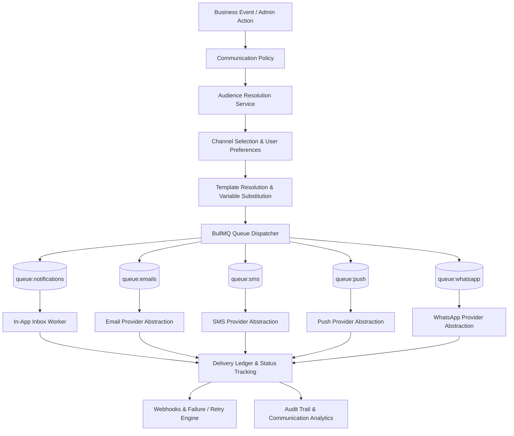

# Phase 4M — Communication & Notification Ecosystem Specification

**Date:** September 19, 2026  
**Status:** **IN SPECIFICATION & PLANNING**  
**Subsystem:** Institutional Communication, Notifications, Announcements, Templates, Audiences, Multi-Channel Delivery (In-App, Email, SMS, Push, WhatsApp), BullMQ Queues, and Delivery Reporting

---

## 1. Scope & System Boundary

Phase 4M transitions the basic notification stub into a comprehensive, multi-channel **Communication & Notification Ecosystem** across all school campuses.

### 1.1 Core Principles & Integrity Constraints
1. **Centralized Communication Pipeline:** Business events from modules (Admissions, Attendance, Exams, Fees, HR, Library, Transport, Hostel, Inventory) flow through a centralized pipeline (`Event → Policy → Audience → Template → Channel Selection → Queue → Provider → Delivery Status → Audit`). Modules do not directly talk to external delivery providers.
2. **Provider Abstraction:** Delivery providers (Email, SMS, Push, WhatsApp) are abstracted behind extensible interfaces (`IEmailProvider`, `ISmsProvider`, `IPushProvider`, `IWhatsAppProvider`). Provider credentials are kept in environment configurations.
3. **No False Delivery Claims:** When external providers (SMS, Push, WhatsApp) are unconfigured in an environment, messages must be recorded as `NOT_CONFIGURED` or `SKIPPED`. They must NEVER be falsely marked `DELIVERED`.
4. **Queue-Backed Asynchronous Scale:** Broadcasts to thousands of recipients (e.g., fee reminders, exam notifications) are queued into BullMQ/Redis (`queue:communications`, `queue:emails`, etc.) and processed asynchronously with retry backoff. API requests never block waiting for bulk delivery.
5. **Idempotency & Deduplication:** Campaigns and message dispatches use idempotency keys and recipient hashing to prevent duplicate sends caused by retries, network glitches, or worker restarts.
6. **Reuse Existing Notification System:** Expand the existing `Notification` model and `NotificationsService` instead of creating an isolated, competing inbox system.

---

## 2. Feature Inventory & Gap Analysis

### EXISTING
- **Prisma Model:** Minimal `Notification` model (`id`, `organizationId`, `userId`, `title`, `message`, `type`, `isRead`, `linkUrl`, `createdAt`).
- **NestJS Module:** Basic `NotificationsModule`, `NotificationsService`, and `NotificationsController` with `getMyNotifications`, `markAsRead`, `markAllAsRead`, and a simple role-based `broadcast`.
- **Queue Service:** `QueueService` (`apps/api/src/core/queue/queue.service.ts`) with BullMQ `Queue` instances for `queue:notifications`, `queue:emails`, `queue:reports`, `queue:payroll`, and `queue:file-processing`.
- **Existing In-App UI:** Basic `/portal/notifications` page for authenticated users to view unread notifications and send a broadcast.
- **Cross-Module Hooks:** Injected `NotificationsModule` in Attendance, Admissions, Timetable, Fees, Payroll, Employees, and Examinations.

### MISSING
- **Multi-Channel Delivery Support:** No channel abstraction for `IN_APP`, `EMAIL`, `SMS`, `PUSH`, and `WHATSAPP`.
- **Provider Implementations:** No provider interfaces or fallback mock/console implementations for development/testing without live credentials.
- **Institutional Announcements:** No `Announcement` entity supporting author, status (`DRAFT`, `SCHEDULED`, `PUBLISHED`, `EXPIRED`), priority, target campus/academic year, or scheduling.
- **Communication Campaigns:** No `CommunicationCampaign` entity orchestrating multi-channel broadcasts, recipient resolution, and aggregate delivery statistics.
- **Communication Delivery Ledger:** No per-recipient delivery log (`CommunicationDelivery`) tracking delivery attempts, failure reasons, and timestamps.
- **Templates & Multi-Language Support:** No template engine (`CommunicationTemplate`, `CommunicationTemplateVersion`) with variable interpolation (`{{student_name}}`), channel binding, and language support (`en`, `ur`, `ar`).
- **Dynamic Audience Segmentation:** No server-side audience resolver supporting roles, campuses, classes, sections, departments, or custom criteria.
- **User Preferences & Quiet Hours:** No `CommunicationPreference` entity for user-controlled channel opt-in/opt-out and quiet-hour silencing.
- **Device Token Registry:** No `DeviceRegistration` entity for mobile/desktop push tokens.
- **Communication Command Center:** No administrative UI for managing announcements, campaigns, templates, audiences, delivery monitoring, and provider health.

### TO IMPLEMENT
1. **Prisma Schema Additions:**
   - **Enums:** `CommunicationChannel`, `CommunicationStatus`, `AnnouncementStatus`, `CommunicationPriority`, `TemplateLanguage`, `DevicePlatform`, `AudienceType`.
   - **Models:**
     - Update `Notification`: Add `priority`, `category`, `readAt`, `campaignId`.
     - `Announcement`: Formal institution broadcasts with author, audience, priority, status, and scheduled dates.
     - `CommunicationTemplate`: Multi-channel templates with code, channel, language, subject, body, and versioning.
     - `CommunicationTemplateVersion`: Historical versions for template auditability.
     - `CommunicationCampaign`: Scheduled or instant campaigns tracking overall stats.
     - `CommunicationDelivery`: Message-level delivery status, provider ref, retry attempts, and errors.
     - `CommunicationAudience`: Saved audience filters for repeat targeting.
     - `CommunicationPreference`: User-level channel preferences and quiet hours.
     - `DeviceRegistration`: Push notification device tokens and platforms.
     - `CommunicationWebhookEvent`: Provider webhook callback event ledger.
2. **Shared Types (`packages/shared-types`):**
   - Create `communication.interface.ts` with all types, DTOs, and KPI definitions.
   - Export in `packages/shared-types/src/index.ts`.
3. **Backend Communication Subsystem (`apps/api/src/modules/communication`):**
   - `communication-providers.service.ts`: Abstraction layer for Email (SMTP/SES/SendGrid ready), SMS (Twilio/Infobip/local ready), Push (FCM/APNS ready), WhatsApp (Meta/Twilio ready). Includes graceful fallback to `NOT_CONFIGURED` or `SKIPPED`.
   - `communication-templates.service.ts`: Template CRUD, safe variable substitution (`{{var}}`), multi-language rendering, version tracking.
   - `communication-audience.service.ts`: Dynamic server-side audience resolution (roles, campuses, grades, sections, staff departments, parents).
   - `communication-campaigns.service.ts`: Campaign creation, queue dispatching, progress tracking, and scheduled execution.
   - `communication-announcements.service.ts`: Institutional announcement lifecycle (`DRAFT` → `SCHEDULED` → `PUBLISHED` → `EXPIRED`).
   - `communication-delivery.service.ts`: Delivery tracking, webhooks processing, retry handling, failure logging.
   - `communication-preferences.service.ts`: User notification preferences, quiet-hour calculation, device registration.
   - `communication-reports.service.ts`: Dashboard KPIs, delivery rates, channel breakdowns, failure summaries.
   - `communication.controller.ts`: REST endpoints with RBAC permissions (`communication:view`, `communication:compose`, `communication:send`, `communication:schedule`, `communication:templates:manage`, etc.).
   - `communication.module.ts`: NestJS module registration and exports.
4. **Enhanced Notifications Service (`apps/api/src/modules/notifications`):**
   - Update `NotificationsService` with overloaded `create` and `broadcast` methods to support existing modules without breaking calls.
5. **Web Command Center (`apps/web`):**
   - Create `/portal/communication/page.tsx` — 8-tab Command Center:
     - 📊 Overview (KPIs, queue status, recent activity)
     - 📢 Announcements (announcement management, publishing)
     - 🚀 Campaign Composer (audience selector, channel picker, template renderer, scheduling)
     - 📝 Templates (template catalog, variables, preview)
     - 👥 Audiences (saved segments and criteria)
     - 📨 Delivery Logs (searchable delivery history, error details)
     - ⚙️ Provider Health (channel configuration and test status)
     - 🔕 Preferences (quiet hours, channel opt-in/opt-out)
   - Preserve and polish `/portal/notifications/page.tsx` (user personal inbox).
6. **Documentation & Verification:**
   - Update `docs/features/feature-status.md`.
   - Create `docs/features/phase4m-final-report.md`.
   - Create `scripts/verify-phase4m.cjs` (300+ automated checks).
   - Verify 100% pass and execute master regressions.

### DEFERRED
- Live external telephony contracts (paid SMS gateway API keys, paid WhatsApp Business API credentials) — ready for plug-in via environment variables.
- Direct mobile carrier integration — handled via standardized SMPP/HTTP SMS gateway provider interface.
- Rich interactive push notifications with custom sound bundles — deferred to native mobile build.

---

## 3. Communication Pipeline Architecture

