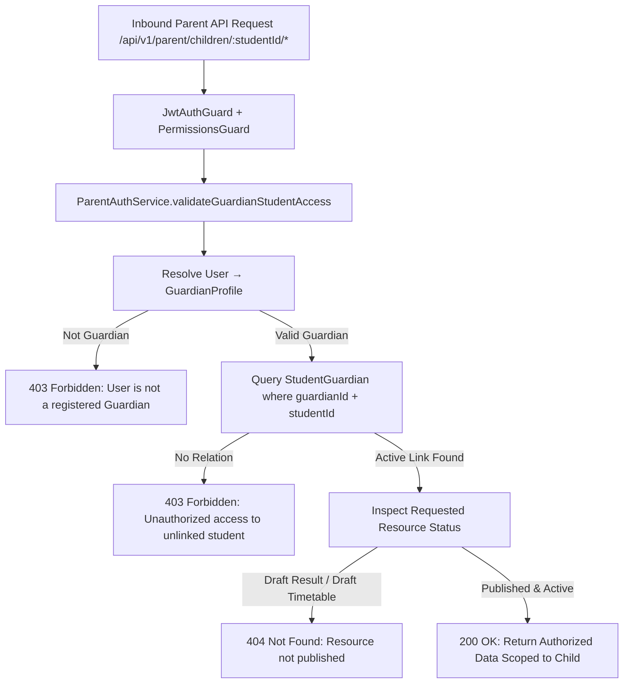

# Phase 4N — Parent & Guardian Portal Specification

**Date:** September 19, 2026  
**Status:** **IN SPECIFICATION & IMPLEMENTATION**  
**Subsystem:** Unified Parent/Guardian Portal, Server-Side Child Authorization, Multi-Child Switching, Academic Progress, Attendance, Timetable, Exams, Results, Report Cards, Fees & Invoicing, Library, Transport, Hostel, Notices, Communications, Documents, Web & Mobile Clients

---

## 1. Scope & System Boundary

Phase 4N introduces a comprehensive, privacy-first **Parent & Guardian Portal** that gives authorized guardians a single, coherent pane of glass into their children's school journey.

### 1.1 Core Principles & Integrity Constraints
1. **Server-Side Relationship Validation (Privacy-First):**
   A parent/guardian may **ONLY** access students explicitly linked to them through an active `StudentGuardian` record. The server validates this relationship on **every single request**. URLs or request bodies containing a `studentId` are never trusted blindly. Any attempt by Parent A to access Child C (belonging to Parent B) returns an immediate `403 Forbidden` or `404 Not Found`.
2. **Safe Multi-Child Switching:**
   Guardians with multiple children can switch between their children seamlessly. On switching, all child-scoped state is cleared and refetched to guarantee that no stale child data (e.g., Child A's attendance) ever appears under Child B.
3. **Published Data Policy:**
   Parents view **only published academic data**:
   - Timetable: Strictly `PUBLISHED` versions (draft versions are hidden).
   - Exams & Results: Strictly `PUBLISHED` results and report cards (draft, submitted, or locked-but-unpublished marks are hidden).
4. **Honest Payment State:**
   If external payment gateways (Stripe, local gateway) are unconfigured, the portal displays `ONLINE PAYMENT NOT CONFIGURED`. It never fabricates successful payments or simulates transaction receipts.
5. **Zero Data Duplication:**
   The portal is a lens onto existing domain systems. It directly queries `StudentProfile`, `AttendanceRecord`, `TimetableEntry`, `ExamResult`, `ReportCard`, `FeeInvoice`, `PaymentTransaction`, `StudentTransportAssignment`, `HostelAllocation`, `Announcement`, and `Notification` without creating secondary storage.
6. **No Administrative Leakage:**
   Parents never see internal staff notes, HR records, administrative audit trails, unverified disciplinary notes, or other families' financial records.

---

## 2. Feature Inventory & Gap Analysis

### EXISTING
- **Prisma Models:**
  - `User`: Identity with role `PARENT`, communication preferences, device registrations.
  - `GuardianProfile`: Linked to `User` via `userId`.
  - `StudentGuardian`: Explicit link between `GuardianProfile` and `StudentProfile` (`relationship`, `isPrimary`, `canPickup`).
  - `StudentProfile`: Identity, admission number, dob, blood group, emergency contacts, enrollments.
  - `AttendanceRecord`: Daily attendance status (`PRESENT`, `ABSENT`, `LATE`, `HALF_DAY`, `EXCUSED`), date, remarks.
  - `TimetableVersion` & `TimetableEntry`: Published class timetables (`PUBLISHED` status).
  - `ExamResult`, `ExamOverallResult`, `ReportCard`: Assessment marks, GPA, percentage, teacher/principal remarks, `isPublished` flag.
  - `FeeInvoice`, `PaymentTransaction`, `InvoiceItem`: Student fee invoices, line items, payments, receipts (`RCP-YYYY-XXXXX`).
  - `StudentTransportAssignment`, `TransportSchedule`, `TransportBoardingEvent`: Bus routes, pickup/drop stops, schedules, boarding records.
  - `HostelAllocation`, `HostelAttendance`, `HostelOuting`: Room/bed assignment, check-in, night roll calls, outing requests.
  - `Announcement` & `Notification`: Institution announcements targeted to parents/grades, personal in-app inbox.
  - `StudentDocument`: Uploaded student files and verification status.
  - `AuditLog`: System audit trail.
- **Web UI & Mobile Foundations:**
  - `/portal/dashboard`: Basic multi-persona tab switcher.
  - `/portal/notifications`: User-level notification center.
  - `apps/mobile`: Flutter client foundation with Dio, secure storage, and theme.
  - `apps/desktop`: Flutter desktop client foundation.

### MISSING
- **Dedicated Backend Module (`apps/api/src/modules/parent`):**
  - No `ParentModule` or `ParentController` providing unified `/api/v1/parent/*` endpoints.
  - No centralized parent-student authorization service (`ParentAuthService`) ensuring strict relationship validation across all child-scoped endpoints.
  - No multi-child resolution endpoint returning all authorized children with active enrollments and campus information.
  - No child overview aggregation endpoint consolidating attendance %, fee balance, upcoming exams, and recent notices in a single efficient call.
  - No published-only filters on exams, results, report cards, and timetables tailored to the parent scope.
  - No child-scoped transport, hostel, and library reader services for parents.
- **Shared Types:**
  - No `parent.interface.ts` defining parent DTOs, child summary cards, and multi-child selector types in `packages/shared-types`.
- **Web Workspace (`apps/web`):**
  - No dedicated `/portal/parent/page.tsx` workspace offering the comprehensive 10-section parent experience with responsive child switching.
  - No parent navigation entry in `Sidebar.tsx`.
- **Mobile Experience (`apps/mobile`):**
  - No dedicated Flutter mobile parent screen with child switcher and mobile-native overview.

### TO IMPLEMENT
1. **Shared Types (`packages/shared-types`):**
   - Create `parent.interface.ts` with all types: `IParentChildSummary`, `IParentChildOverview`, `IParentChildProfile`, `IParentAttendanceSummary`, `IParentTimetable`, `IParentExamResult`, `IParentReportCard`, `IParentFeeSummary`, `IParentTransportInfo`, `IParentHostelInfo`, `IParentNotice`, `IParentProfile`.
   - Export in `packages/shared-types/src/index.ts`.
2. **Backend Architecture (`apps/api/src/modules/parent`):**
   - `parent-auth.service.ts`: Centralized authorization policy verifying:
     `User → GuardianProfile → StudentGuardian (ACTIVE) → StudentProfile`. Throws `ForbiddenException` on unauthorized attempts.
   - `parent-children.service.ts`: Resolves authorized children list, child profile details, and aggregated child overview dashboard.
   - `parent-academic.service.ts`: Child attendance history & percentage, published timetable, upcoming eligible exams, published exam results, published report cards.
   - `parent-finance.service.ts`: Child fee invoices, itemized fee structures, payment transaction receipts, honest payment gateway status (`NOT_CONFIGURED`).
   - `parent-services.service.ts`: Child transport assignment & stops, hostel room allocation & night roll-calls, library loans & due dates, authorized student documents.
   - `parent-communication.service.ts`: Announcements targeted to parent/children, notification inbox, teacher/school communication.
   - `parent-profile.service.ts`: Parent personal profile, linked children roster, notification & quiet hours preferences.
   - `parent.controller.ts`: 25+ REST endpoints with RBAC permissions (`parent:portal:view`, `parent:children:view`, `parent:attendance:view`, `parent:results:view`, `parent:fees:view`, etc.).
   - `parent.module.ts`: Registered in `AppModule`.
3. **Web Experience (`apps/web`):**
   - Create `/portal/parent/page.tsx`:
     - Dynamic Child Selector Bar (avatar, name, admission #, grade/section, campus, status).
     - Immediate state flushing on child switch to prevent cross-child data bleeding.
     - 10 Tabs / Views:
       1. 🏠 **Overview:** Attention alerts (e.g. absent today, fee due, exam tomorrow), KPI cards, quick actions.
       2. 👤 **Child Profile:** Identity, academic enrollment, emergency contacts, guardians list.
       3. 📅 **Attendance:** Monthly attendance calendar/table, stats (present/absent/late/percentage).
       4. 🕒 **Timetable:** Published weekly schedule with periods, subjects, teachers, and rooms.
       5. 📝 **Exams & Results:** Upcoming eligible exams, published marks, GPA, overall session results.
       6. 📜 **Report Cards:** Official published report cards with attendance, remarks, and download action.
       7. 💳 **Fees & Receipts:** Invoices, due dates, paid vs outstanding balance, receipt downloads, honest payment state.
       8. 🚌 **Transport & Hostel:** Bus route, pickup/drop stop, hostel building, room/bed, night roll-calls.
       9. 📢 **Notices & Messages:** Circulars targeted to the child's grade, notifications, and school messaging.
       10. ⚙️ **My Profile & Settings:** Guardian contact info, communication preferences, quiet hours.
   - Update `Sidebar.tsx` with `Parent Portal` under Academic & Community.
4. **Mobile Experience (`apps/mobile`):**
   - Create `apps/mobile/lib/features/parent/parent_portal_screen.dart` with child selector, cards for attendance, exams, fees, and network error handling.
5. **Documentation & Verification:**
   - Update `docs/features/feature-status.md` (mark Phase 4N `VERIFIED`).
   - Create `docs/features/phase4n-final-report.md`.
   - Create `scripts/verify-phase4n.cjs` with 250+ automated checks including security boundary isolation tests.

### DEFERRED
- Live third-party payment gateway merchant contracts (Stripe/PayFast live webhooks) — ready for plug-in; displays honest `ONLINE PAYMENT NOT CONFIGURED` when keys are absent.
- Real-time GPS vehicle tracking map — shows static route, stop, and schedule without pretending live GPS telemetry exists.

---

## 3. Security & Authorization Architecture

